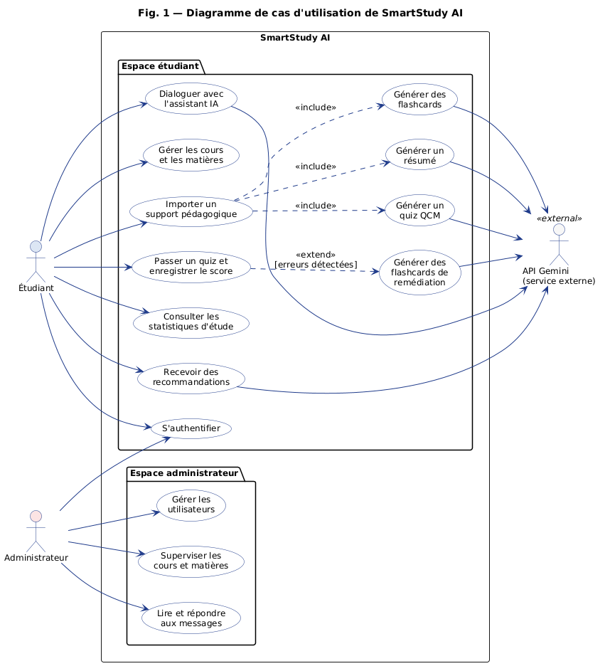
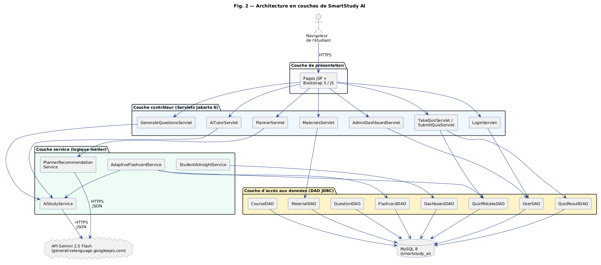
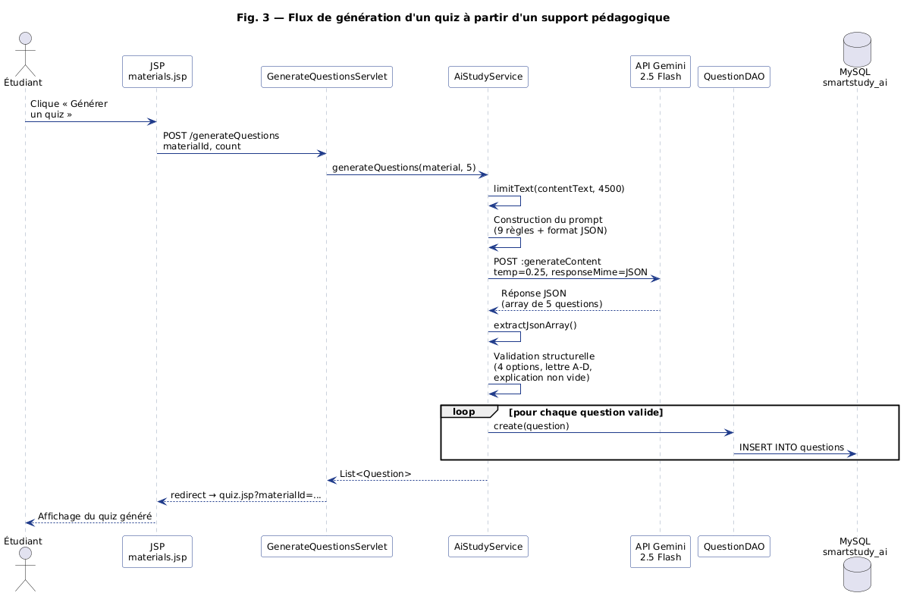
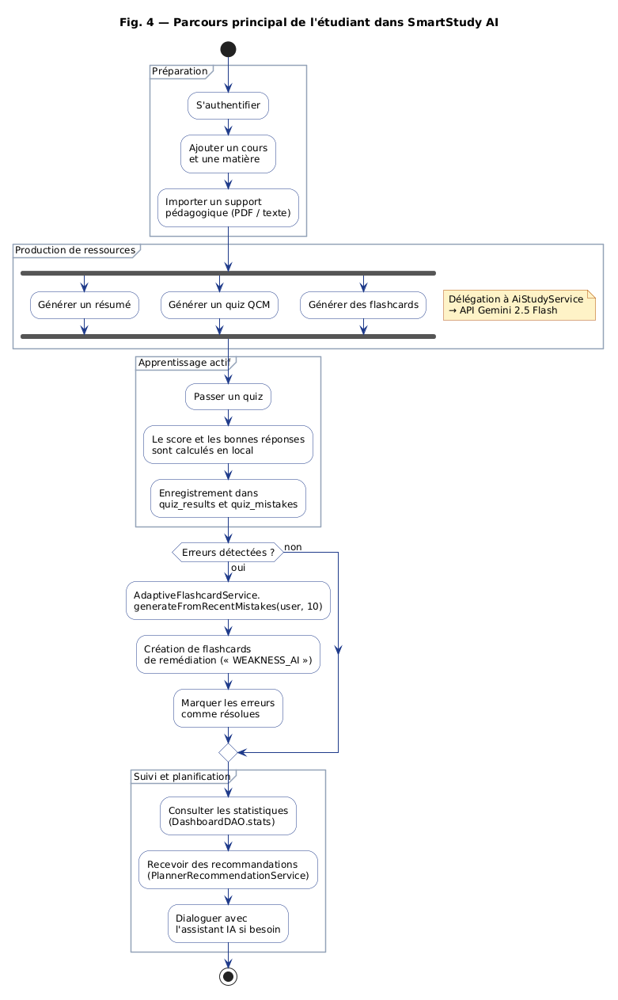
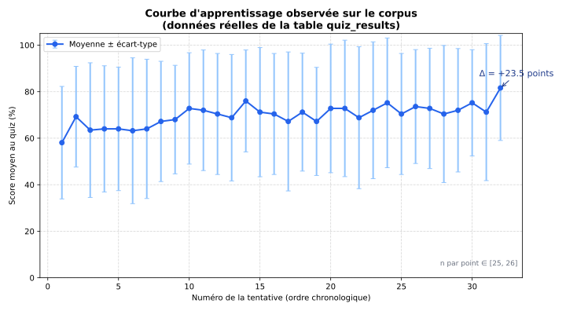
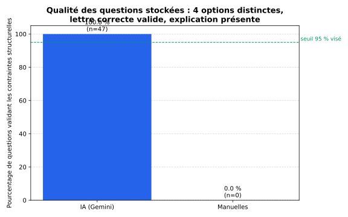
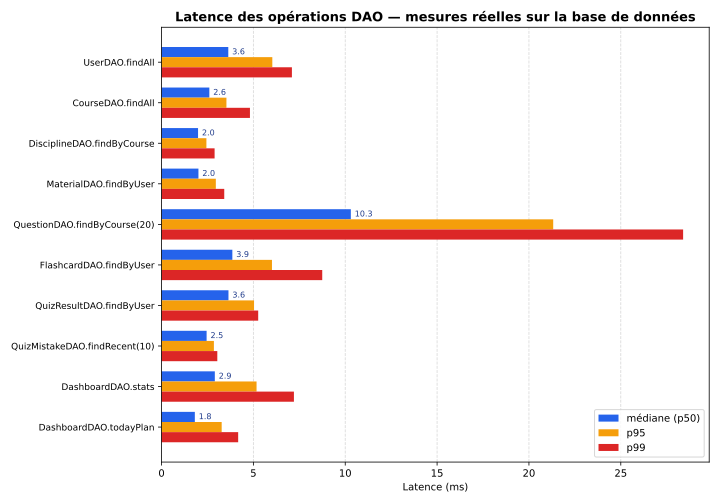
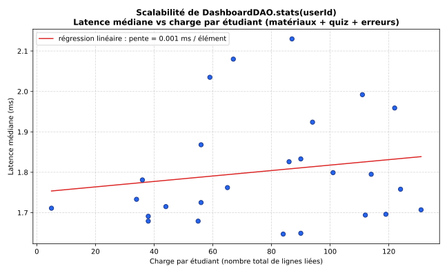

<h1 align="center"><strong>SmartStudy AI</strong></h1>
<h3 align="center">Plateforme web Java EE d'apprentissage assisté par intelligence artificielle</h3>
<h4 align="center"><em>Génération automatique de résumés, de QCM et de flashcards, remédiation adaptative et tableau de bord d'apprentissage</em></h4>

<p align="center">
  <strong>Auteurs :</strong> ILIE Aris-Georgian &amp; PAPUC Mihalache &nbsp;|&nbsp;
  <strong>Université :</strong> Université Nationale de Science et Technologie POLITEHNICA Bucarest &nbsp;|&nbsp;
  <strong>Faculté :</strong> Faculté d'Ingénierie en Langues Étrangères &nbsp;|&nbsp;
  <strong>Spécialisation :</strong> Ingénierie de l'Information
</p>

<p align="center">
  
  
  
  
  
  
  
</p>

---

## Table des matières

- [Description](#-description)
- [Motivation](#-motivation)
- [Acteurs du système](#-acteurs-du-système)
- [Fonctionnalités principales](#-fonctionnalités-principales)
- [Architecture](#-architecture)
  - [Diagramme de cas d'utilisation](#diagramme-de-cas-dutilisation)
  - [Architecture en couches](#architecture-en-couches)
  - [Diagramme de séquence — génération d'un quiz](#diagramme-de-séquence--génération-dun-quiz)
  - [Parcours étudiant](#parcours-étudiant)
  - [Schéma de la base de données](#schéma-de-la-base-de-données)
- [Composantes logicielles](#-composantes-logicielles)
- [Règles métier](#-règles-métier)
- [Design patterns](#-design-patterns)
- [Évaluation expérimentale](#-évaluation-expérimentale)
- [Technologies et bibliothèques](#-technologies-et-bibliothèques)
- [Organisation du projet](#-organisation-du-projet)
- [Structure de la base de données](#-structure-de-la-base-de-données)
- [Installation et démarrage](#-installation-et-démarrage)
- [Reproduction des expériences](#-reproduction-des-expériences)
- [Perspectives d'évolution](#-perspectives-dévolution)
- [Bibliographie](#-bibliographie)
- [Auteurs et encadrement](#-auteurs-et-encadrement)

---

## Description

<p align="justify">
Le projet <strong>SmartStudy AI</strong> est une application web Java EE qui transforme les supports de cours de l'étudiant — fichiers PDF, documents texte, transcriptions — en ressources d'apprentissage actives : <strong>résumés</strong>, <strong>questions à choix multiples</strong>, <strong>flashcards</strong>, <strong>recommandations de révision</strong> et conversations avec un <strong>assistant IA</strong>. Le moteur génératif est <em>Gemini 2.5 Flash</em>, appelé par HTTPS en mode JSON forcé pour produire des sorties structurées et validables.
</p>

<p align="justify">
Le système repose sur deux rôles principaux — <strong>Étudiant</strong> et <strong>Administrateur</strong> — et conserve une séparation stricte entre la couche déterministe (scores, erreurs, statistiques calculées en local par les DAO) et la couche générative (résumés, QCM et flashcards produits par l'IA). Cette séparation permet de bénéficier de la souplesse des grands modèles de langage tout en limitant les risques d'imprécision ou d'hallucination.
</p>

<p align="justify">
Le projet inclut un <strong>banc d'essai expérimental reproductible</strong> (<code>com.smartstudy.experiments.ExperimentRunner</code>) qui mesure la performance et la qualité du système sur un corpus déterministe : 26 étudiants, 6 cours, 47 questions, 803 tentatives de quiz. Les résultats — gain d'apprentissage apparié, validité structurelle des QCM, latence des DAO, scalabilité du tableau de bord — sont publiés dans l'article scientifique associé.
</p>

---

## Motivation

<p align="justify">
Les étudiants universitaires accumulent un volume croissant de supports numériques mais manquent d'outils pour les structurer, vérifier leur compréhension et planifier leurs révisions. Les plateformes existantes restent souvent cloisonnées : un site pour les résumés, un autre pour les flashcards, un troisième pour les quiz. SmartStudy AI propose un flux unique « <em>support de cours → ressource active → suivi → remédiation</em> » entièrement instrumenté et observable.
</p>

<p align="justify">
Du point de vue du candidat étudiant, l'application offre un espace personnel où il peut importer ses documents et obtenir, en quelques secondes, un résumé, un quiz et un jeu de flashcards. Du point de vue de l'administrateur, elle fournit une vue de supervision sur les utilisateurs, les cours et les conversations de support. Le projet a également une forte valeur pédagogique : il combine modélisation UML, architecture en couches Java EE, intégration d'un grand modèle de langage et évaluation quantitative reproductible.
</p>

---

## Acteurs du système

### 1. Étudiant
<p align="justify">
L'étudiant est l'utilisateur principal. Après création de compte et authentification, il peut gérer ses cours, importer des matériaux pédagogiques au format PDF, DOCX ou texte, générer des résumés, des QCM et des flashcards à partir de ces matériaux, passer des quiz, consulter ses statistiques d'étude et dialoguer avec l'assistant IA. Lorsqu'il commet des erreurs en quiz, le module de remédiation adaptative produit automatiquement des flashcards ciblées sur ses sujets faibles.
</p>

### 2. Administrateur
<p align="justify">
L'administrateur dispose d'un espace séparé. Il peut consulter et gérer les utilisateurs, voir les cours créés, suivre les conversations de support envoyées par les étudiants, et répondre aux demandes d'élévation de privilèges. Il assure le respect des règles métier et l'intégrité globale de la plateforme.
</p>

### 3. API Gemini (service externe)
<p align="justify">
L'API <em>Gemini 2.5 Flash</em> de Google joue le rôle de service externe d'intelligence artificielle. Elle est appelée par HTTPS en mode JSON forcé pour générer les résumés, les QCM, les flashcards, les recommandations du planificateur et les réponses du tuteur. Aucun appel n'est fait depuis le navigateur de l'étudiant — toutes les requêtes transitent par le serveur Tomcat.
</p>

### 4. Équipe de développement
<p align="justify">
L'équipe est responsable de la conception, de l'implémentation, de l'évaluation expérimentale et de la documentation du système.
</p>

### 5. Testeur / évaluateur
<p align="justify">
Le testeur vérifie la conformité fonctionnelle du système, contrôle les contenus générés par IA et contribue à l'amélioration de la qualité globale de l'application.
</p>

---

## Fonctionnalités principales

### Fonctionnalités communes
- Créer un compte (nom, e-mail, mot de passe BCrypt)
- Se connecter / se déconnecter avec session HTTP
- Récupérer le mot de passe (token e-mail par Jakarta Mail)
- Modifier son profil et sa description

### Fonctionnalités de l'étudiant
- Créer un cours, lui associer des disciplines et une date d'examen
- Importer un matériau pédagogique (PDF extrait par Apache PDFBox, DOCX ou texte brut)
- **Générer un résumé IA** à partir du matériau (`AiStudyService.generateSummary`)
- **Générer un quiz QCM** de 5 questions (`AiStudyService.generateQuestions`) avec validation structurelle des sorties
- **Générer des flashcards** à partir d'un matériau (`generateFlashcards`)
- Passer un quiz : enregistrement automatique du score, des erreurs et du temps passé
- **Remédiation adaptative** : génération de flashcards à partir des 10 erreurs les plus récentes (`AdaptiveFlashcardService.generateFromRecentMistakes`)
- Consulter le **tableau de bord** : nombre de cours, minutes étudiées, score moyen, alertes de lacunes, plan du jour
- Recevoir des **recommandations personnalisées** générées par `PlannerRecommendationService`
- Dialoguer avec l'**assistant IA** (`AiCoachServlet`) — réponses en français, roumain ou anglais selon la langue de la question
- Visualiser les **statistiques d'étude** sur les dernières semaines

### Fonctionnalités de l'administrateur
- Consulter et gérer les comptes utilisateurs
- Consulter les détails et l'activité d'un étudiant (`AdminStudentDetailsServlet`)
- Répondre aux conversations de support (`AdminChatServlet`)
- Approuver ou rejeter les demandes d'élévation au rôle d'administrateur
- Supprimer des comptes

---

## Architecture

<p align="justify">
L'application suit une <strong>architecture web en couches</strong> conforme au modèle MVC : pages JSP pour la vue, Servlets Jakarta pour le contrôle, services métier pour la logique applicative, classes DAO en JDBC pour l'accès aux données, et un service externe d'IA pour les fonctionnalités génératives. Cette organisation découple chaque responsabilité et permet de remplacer un composant — par exemple le fournisseur d'IA — sans impacter le reste.
</p>

### Diagramme de cas d'utilisation

<p align="center">
  
</p>

<p align="justify">
Ce diagramme présente les principales interactions entre les acteurs (Étudiant, Administrateur, API Gemini) et les fonctionnalités disponibles. Les flèches <code>&lt;&lt;include&gt;&gt;</code> indiquent que l'importation d'un support déclenche systématiquement la génération de résumés, de quiz et de flashcards ; la flèche <code>&lt;&lt;extend&gt;&gt;</code> montre que la génération de flashcards de remédiation est conditionnée à la présence d'erreurs détectées lors d'un quiz.
</p>

### Architecture en couches

<p align="center">
  
</p>

<p align="justify">
L'architecture est strictement en couches. La <strong>couche présentation</strong> contient les pages JSP, Bootstrap 5 et JavaScript ; elle est responsable de l'affichage et n'accède jamais directement à la base. La <strong>couche contrôleur</strong> regroupe les Servlets Jakarta 6 — par exemple <code>GenerateQuestionsServlet</code>, <code>SubmitQuizServlet</code>, <code>AiTutorServlet</code> — qui orchestrent les services. La <strong>couche service</strong> contient la logique métier : <code>AiStudyService</code>, <code>AdaptiveFlashcardService</code>, <code>PlannerRecommendationService</code>, <code>StudentAiInsightService</code>. La <strong>couche d'accès aux données</strong> rassemble les classes DAO en JDBC direct, sans ORM, sur MySQL 8. Enfin, un <strong>service externe d'IA</strong> est invoqué par les services métier pour les fonctionnalités génératives.
</p>

### Diagramme de séquence — génération d'un quiz

<p align="center">
  
</p>

<p align="justify">
Ce diagramme détaille le pipeline complet de génération d'un QCM. L'étudiant clique sur « Générer un quiz » dans <code>materials.jsp</code>. Le servlet <code>GenerateQuestionsServlet</code> appelle <code>AiStudyService.generateQuestions(material, 5)</code>, qui (i) limite le texte du matériau à 4 500 caractères, (ii) construit un prompt avec neuf règles structurelles imposant un format JSON, (iii) appelle l'API Gemini en mode JSON forcé (<code>responseMimeType: application/json</code>, température 0,25), (iv) valide chaque question (quatre options non vides et distinctes, lettre de réponse correcte, explication présente), puis (v) délègue à <code>QuestionDAO.create</code> l'insertion en base. Une fois le quiz produit, le servlet redirige vers <code>quiz.jsp</code>.
</p>

### Parcours étudiant

<p align="center">
  
</p>

<p align="justify">
Ce diagramme d'activité résume le parcours complet d'un étudiant. Après authentification et création d'un cours, il importe un support pédagogique. La plateforme parallélise la génération du résumé, du quiz et des flashcards. L'étudiant passe ensuite le quiz, dont les résultats sont enregistrés dans <code>quiz_results</code> et les erreurs dans <code>quiz_mistakes</code>. Si des erreurs sont détectées, <code>AdaptiveFlashcardService</code> produit des flashcards de remédiation marquées <code>WEAKNESS_AI</code>, puis marque les erreurs comme résolues. Enfin, l'étudiant consulte ses statistiques et reçoit des recommandations personnalisées.
</p>

### Schéma de la base de données

<p align="center">
  
</p>

<p align="justify">
Le schéma relationnel de SmartStudy AI s'articule autour de l'entité <code>users</code>. Chaque étudiant possède plusieurs <code>courses</code>, eux-mêmes structurés en <code>disciplines</code>. Les <code>materials</code> contiennent le texte brut et un résumé IA optionnel. Les <code>questions</code> et <code>flashcards</code> dérivent d'un matériau et peuvent être marquées comme générées par IA. Les tables <code>quiz_results</code>, <code>quiz_mistakes</code>, <code>study_sessions</code>, <code>study_plan_items</code> et <code>planner_recommendations</code> constituent la couche d'analytique d'apprentissage. Toutes les clés étrangères utilisent <code>ON DELETE CASCADE</code> pour garantir la cohérence référentielle.
</p>

---

## Composantes logicielles

<table>
  <thead>
    <tr>
      <th>Couche</th>
      <th>Rôle</th>
      <th>Classes principales (extrait de <code>com.smartstudy</code>)</th>
    </tr>
  </thead>
  <tbody>
    <tr>
      <td><strong>Vue (JSP)</strong></td>
      <td>Rendu HTML et interaction utilisateur</td>
      <td><code>views/student/dashboard.jsp</code>, <code>materials.jsp</code>, <code>quiz.jsp</code>, <code>flashcards.jsp</code>, <code>ai-coach.jsp</code>, <code>views/admin/dashboard.jsp</code>, <code>users.jsp</code>, <code>chat.jsp</code></td>
    </tr>
    <tr>
      <td><strong>Contrôleur (Servlets)</strong></td>
      <td>Routage HTTP et orchestration des services</td>
      <td><code>LoginServlet</code>, <code>RegisterServlet</code>, <code>DashboardServlet</code>, <code>MaterialsServlet</code>, <code>GenerateQuestionsServlet</code>, <code>TakeQuizServlet</code>, <code>SubmitQuizServlet</code>, <code>FlashcardsServlet</code>, <code>AiTutorServlet</code>, <code>AiCoachServlet</code>, <code>PlannerServlet</code>, <code>InsightsServlet</code>, <code>AdminDashboardServlet</code>, <code>AdminUsersServlet</code>, <code>AdminChatServlet</code></td>
    </tr>
    <tr>
      <td><strong>Filtre</strong></td>
      <td>Contrôle de session et de rôle avant les pages protégées</td>
      <td><code>AuthFilter</code></td>
    </tr>
    <tr>
      <td><strong>Service (logique métier)</strong></td>
      <td>Cas d'usage applicatifs et appels à l'IA</td>
      <td><code>AiStudyService</code> (génération résumé / QCM / flashcards / chat), <code>AdaptiveFlashcardService</code> (remédiation à partir des erreurs), <code>PlannerRecommendationService</code> (3 recommandations IA), <code>StudentAiInsightService</code>, <code>StudyPlanService</code>, <code>AiTutorService</code></td>
    </tr>
    <tr>
      <td><strong>DAO (accès JDBC)</strong></td>
      <td>CRUD direct via <code>PreparedStatement</code></td>
      <td><code>UserDAO</code>, <code>CourseDAO</code>, <code>DisciplineDAO</code>, <code>MaterialDAO</code>, <code>QuestionDAO</code>, <code>FlashcardDAO</code>, <code>QuizResultDAO</code>, <code>QuizMistakeDAO</code>, <code>DashboardDAO</code>, <code>ChatMessageDAO</code>, <code>AiFeedbackDAO</code>, <code>RememberTokenDAO</code></td>
    </tr>
    <tr>
      <td><strong>Modèle (POJO)</strong></td>
      <td>Entités du domaine</td>
      <td><code>User</code>, <code>Course</code>, <code>Discipline</code>, <code>Material</code>, <code>Question</code>, <code>Flashcard</code>, <code>QuizResult</code>, <code>QuizMistake</code>, <code>ChatMessage</code>, <code>ChatConversation</code>, <code>DashboardStats</code>, <code>AiFeedback</code></td>
    </tr>
    <tr>
      <td><strong>Utilitaires</strong></td>
      <td>Connexion DB, extraction PDF, e-mail, sécurité</td>
      <td><code>DBConnection</code>, <code>PdfTextExtractor</code>, <code>EmailUtil</code>, <code>RememberMeUtil</code></td>
    </tr>
    <tr>
      <td><strong>Banc d'essai</strong></td>
      <td>Évaluation expérimentale reproductible</td>
      <td><code>ExperimentSeeder</code>, <code>ExperimentRunner</code>, <code>CsvWriter</code>, <code>Statistics</code></td>
    </tr>
  </tbody>
</table>

---

## Règles métier

1. Tout utilisateur doit posséder un compte valide (e-mail unique + mot de passe haché BCrypt) pour accéder aux fonctionnalités protégées.
2. Les rôles supportés sont strictement <code>STUDENT</code> ou <code>ADMIN</code>. Le filtre `AuthFilter` rejette toute requête vers une page admin sans rôle approprié.
3. Le matériau importé doit être au format <strong>PDF</strong>, <strong>DOCX</strong>, <strong>transcription</strong> ou <strong>texte brut</strong>. L'extraction est faite par Apache PDFBox pour les PDF.
4. La génération d'un quiz est limitée à <strong>5 questions</strong> par appel (variable <code>safeCount</code>) pour respecter les quotas de l'API Gemini.
5. Toute question stockée en base doit satisfaire quatre contraintes structurelles : (i) quatre options non vides, (ii) options deux-à-deux distinctes, (iii) lettre de réponse ∈ {A, B, C, D}, (iv) explication présente.
6. Le résumé IA d'un matériau est tronqué à 4 000 caractères en entrée et à `MAX_OUTPUT_TOKENS = 4 096` en sortie.
7. La remédiation adaptative s'appuie sur les <strong>10 erreurs non résolues les plus récentes</strong> de l'étudiant ; ces erreurs sont marquées comme résolues après production des flashcards de remédiation.
8. Toute génération de flashcards de remédiation crée automatiquement une session d'étude de 5 minutes (<code>DashboardDAO.addStudySession</code>) pour refléter l'effort dans le tableau de bord.
9. Les recommandations du planificateur sont strictement limitées à <strong>3 par exécution</strong> ; un mécanisme de fallback insère des recommandations statiques si l'appel à Gemini échoue.
10. La clé API Gemini est lue dans la variable d'environnement <code>GEMINI_API_KEY</code> ; elle n'est jamais sérialisée côté client ni stockée en base.
11. La langue de réponse de l'assistant IA s'aligne automatiquement sur la langue de la question (FR / RO / EN), conformément à l'instruction système de <code>AiStudyService</code>.
12. Les conversations de support entre étudiant et administrateur sont stockées dans <code>chat_messages</code> avec horodatage, ce qui assure la traçabilité.

---

## Design patterns

### 1. Singleton — connexion à la base
<p align="justify">
La classe <code>DBConnection</code> centralise l'obtention d'une connexion JDBC. En environnement de développement, elle se connecte à <code>localhost:3306</code> avec l'utilisateur <code>root</code> ; en production sur Azure App Service, elle lit la variable d'environnement <code>MYSQLCONNSTR_localdb</code> ou un fichier monté à <code>D:\home\data\mysql\MYSQLCONNSTR_localdb.txt</code>. Cette unique source de configuration évite la duplication des chaînes de connexion.
</p>

### 2. DAO (Data Access Object)
<p align="justify">
Chaque entité métier possède sa classe DAO dédiée : <code>UserDAO</code>, <code>MaterialDAO</code>, <code>QuestionDAO</code>, <code>FlashcardDAO</code>, etc. Les requêtes SQL sont écrites avec <code>PreparedStatement</code> pour empêcher toute injection SQL. La logique métier (services) n'accède jamais directement à JDBC.
</p>

### 3. Service Layer
<p align="justify">
Les services (<code>AiStudyService</code>, <code>AdaptiveFlashcardService</code>, <code>PlannerRecommendationService</code>) encapsulent les cas d'usage applicatifs et coordonnent plusieurs DAO. Cela permet de réutiliser la même logique depuis plusieurs servlets et de tester chaque cas d'usage de manière isolée.
</p>

### 4. Filter (Front Controller léger)
<p align="justify">
La classe <code>AuthFilter</code> intercepte chaque requête HTTP avant qu'elle n'atteigne un servlet protégé. Elle vérifie la session, le rôle et redirige vers <code>/login</code> en cas d'accès non autorisé. C'est l'implémentation Jakarta du <em>Front Controller</em>.
</p>

### 5. Strategy (génération conditionnelle de prompt)
<p align="justify">
Dans <code>AiStudyService</code>, chaque type de ressource (résumé, QCM, flashcard, conseil) utilise une stratégie de construction de prompt différente, mais une même méthode de transport <code>callGeminiText(prompt, jsonMode)</code>. Cela permet d'ajouter une nouvelle ressource générative sans modifier le client HTTP.
</p>

### 6. Adapter (intégration de l'API externe Gemini)
<p align="justify">
La méthode <code>callGeminiText</code> sert d'adaptateur entre le modèle de données interne de l'application et le format JSON spécifique attendu par l'API Gemini. Si Google modifie son API, seule cette méthode est à mettre à jour.
</p>

---

## Évaluation expérimentale

<p align="justify">
Le projet inclut un banc d'essai reproductible qui mesure le comportement réel de la plateforme à partir d'un corpus déterministe stocké dans la base de production. <strong>Aucune valeur publiée n'est synthétique</strong> : chaque chiffre provient soit d'une requête DAO chronométrée, soit d'une agrégation sur les tables réelles.
</p>

### Indicateurs principaux (corpus reproductible, n = 26 étudiants)

| Indicateur | Valeur observée | Interprétation |
|---|---|---|
| Gain apparié entre première et dernière tentative | <strong>+22,3 points de %</strong> (test <em>t</em> = 4,35 ; <em>d</em> de Cohen = 0,93) | Effet large, significatif à <em>p</em> &lt; 0,01 |
| Validité structurelle des QCM générés par IA | <strong>100 %</strong> (47/47) | Robustesse du pipeline prompt + JSON + validation |
| Taux de compression moyen des résumés IA | <strong>0,26</strong> | Résumés environ 3,8 fois plus courts que la source |
| Latence DAO p95 (9 opérations sur 10) | <strong>&lt; 6,1 ms</strong> | Réactivité compatible avec une UI fluide |
| Scalabilité du tableau de bord (Pearson <em>r</em>) | <strong>0,17</strong> | Latence indépendante de la charge utilisateur |
| Couverture adaptative des sujets faibles (médiane) | <strong>0,83</strong> | Top-10 des erreurs récentes couvre 83 % des disciplines faibles |
| Précision @ 1 du ciblage adaptatif | <strong>0,68</strong> | Discipline dominante identifiée dans 68 % des cas |

### Figures expérimentales

<table>
<tr>
<td align="center" width="50%">
<br>
<em>Fig. 6 — Courbe d'apprentissage (gain +22,3 pts, d = 0,93)</em>
</td>
<td align="center" width="50%">
<br>
<em>Fig. 7 — Validité structurelle des QCM (100 %)</em>
</td>
</tr>
<tr>
<td align="center" width="50%">
<br>
<em>Fig. 8 — Latence des opérations DAO</em>
</td>
<td align="center" width="50%">
<br>
<em>Fig. 9 — Scalabilité de DashboardDAO.stats</em>
</td>
</tr>
</table>

<p align="justify">
La méthodologie complète, les CSV bruts et le protocole de reproduction sont décrits dans <code>experiments/HOW_TO_RUN.md</code>. La section « <a href="#-reproduction-des-expériences">Reproduction des expériences</a> » ci-dessous résume les commandes nécessaires.
</p>

---

## Technologies et bibliothèques

<table>
  <thead>
    <tr>
      <th>Technologie / Outil</th>
      <th>Version</th>
      <th>Rôle dans le projet</th>
    </tr>
  </thead>
  <tbody>
    <tr><td>Java SE</td><td>17</td><td>Langage principal de développement</td></tr>
    <tr><td>Jakarta Servlet API</td><td>6.0</td><td>Contrôleurs HTTP (les Servlets)</td></tr>
    <tr><td>Jakarta Server Pages (JSP)</td><td>3.0</td><td>Vues côté serveur</td></tr>
    <tr><td>Apache Tomcat</td><td>10.x</td><td>Conteneur d'exécution servlets / JSP</td></tr>
    <tr><td>MySQL</td><td>8.4</td><td>Base de données relationnelle</td></tr>
    <tr><td>MySQL Connector/J</td><td>8.4.0</td><td>Pilote JDBC</td></tr>
    <tr><td>Google Gson</td><td>2.11.0</td><td>Sérialisation/désérialisation JSON pour l'API Gemini</td></tr>
    <tr><td>Apache PDFBox</td><td>3.0.7</td><td>Extraction du texte à partir des supports PDF</td></tr>
    <tr><td>Jakarta Mail</td><td>2.0.1</td><td>Envoi des e-mails de récupération de mot de passe</td></tr>
    <tr><td>Bootstrap</td><td>5</td><td>Mise en forme responsive de l'interface JSP</td></tr>
    <tr><td>Google Gemini API</td><td>2.5 Flash</td><td>Modèle génératif pour résumés, QCM, flashcards et tuteur</td></tr>
    <tr><td>Apache Maven</td><td>3.8+</td><td>Construction du projet, gestion des dépendances</td></tr>
    <tr><td>PlantUML</td><td>—</td><td>Génération des cinq diagrammes UML de ce dépôt</td></tr>
    <tr><td>matplotlib + pandas</td><td>3.x / 2.x</td><td>Tracé des figures expérimentales en SVG</td></tr>
    <tr><td>Azure App Service</td><td>—</td><td>Hébergement de production (avec base MySQL gérée)</td></tr>
    <tr><td>GitHub</td><td>—</td><td>Versionnement, documentation et collaboration</td></tr>
  </tbody>
</table>

---

## Organisation du projet

<p align="justify">
Le projet suit la disposition standard Maven d'une application web Java EE, avec un répertoire <code>experiments/</code> dédié au banc d'essai expérimental et un répertoire <code>images/</code> contenant les diagrammes utilisés dans cette documentation.
</p>

```text
smartstudy-ai2/
│
├── README.md
├── LICENSE
├── pom.xml
│
├── images/                                ← diagrammes pour le README
│   ├── 01_diagramme_cas_utilisation.png   ← rendu de diagrams/01_use_case.puml
│   ├── 02_architecture_couches.png        ← rendu de diagrams/02_architecture.puml
│   ├── 03_diagramme_sequence_quiz.png     ← rendu de diagrams/03_ai_flow.puml
│   ├── 04_parcours_etudiant.png           ← rendu de diagrams/04_journey.puml
│   ├── 05_schema_base_donnees.png         ← rendu de diagrams/05_schema_base_donnees.puml
│   ├── exp2_latence_dao.svg               ← copie depuis experiments/.../figures/
│   ├── exp3_distribution_scores.svg
│   ├── exp4_qualite_questions.svg
│   ├── exp5_compression_resumes.svg
│   ├── exp6_courbe_apprentissage.svg
│   ├── exp8_couverture_adaptative.svg
│   └── exp9_scalabilite_dashboard.svg
│
├── database/
│   ├── smartstudy_ai.sql                  ← schéma initial + données de démo
│   └── experiments_schema.sql             ← migrations idempotentes (banc d'essai)
│
├── src/
│   ├── main/
│   │   ├── java/com/smartstudy/
│   │   │   ├── dao/                       ← UserDAO, CourseDAO, MaterialDAO, …
│   │   │   ├── filter/                    ← AuthFilter
│   │   │   ├── model/                     ← POJO : User, Course, Material, …
│   │   │   ├── service/                   ← AiStudyService, AdaptiveFlashcardService, …
│   │   │   ├── servlet/                   ← 30+ servlets (Login, Dashboard, AiTutor, …)
│   │   │   ├── util/                      ← DBConnection, PdfTextExtractor, EmailUtil
│   │   │   └── experiments/               ← banc d'essai (Seeder, Runner, CSV, Stats)
│   │   ├── resources/
│   │   └── webapp/
│   │       ├── assets/                    ← CSS / JS / images
│   │       ├── WEB-INF/
│   │       │   ├── web.xml
│   │       │   ├── lib/                   ← jars hors Maven si nécessaire
│   │       │   └── views/
│   │       │       ├── student/           ← dashboard, materials, quiz, flashcards, …
│   │       │       └── admin/             ← dashboard, users, chat, student-details
│   │       └── index.jsp
│   └── test/                              ← JUnit
│
└── experiments/
    ├── HOW_TO_RUN.md                      ← procédure complète seeder → runner → SVG
    ├── README.md
    ├── make_figures.py                    ← matplotlib → SVG en français
    └── paper/
        ├── SmartStudyAI_paper_v2.docx     ← article scientifique (format SCSS)
        ├── SmartStudyAI_paper_v2.md
        ├── HOW_TO_USE.md
        ├── diagrams/                      ← cinq sources PlantUML
        │   ├── 01_use_case.puml
        │   ├── 02_architecture.puml
        │   ├── 03_ai_flow.puml
        │   ├── 04_journey.puml
        │   └── 05_schema_base_donnees.puml
        └── figures/                       ← CSV bruts + SVG produits par le runner
```

---

## Structure de la base de données

<p align="justify">
La base de données <code>smartstudy_ai</code> est conçue pour représenter le flux pédagogique complet, depuis l'utilisateur jusqu'à l'analytique d'apprentissage. Les douze tables principales sont :
</p>

- **`users`** — comptes utilisateurs avec mot de passe haché, rôle (`STUDENT`/`ADMIN`) et description.
- **`courses`** — cours créés par un étudiant ou par l'administrateur, avec date d'examen et niveau de difficulté.
- **`disciplines`** — sous-divisions d'un cours (matières / chapitres).
- **`materials`** — supports importés (PDF, DOCX, transcription, texte brut), contenu textuel et résumé IA optionnel.
- **`questions`** — QCM générés par IA ou créés manuellement, liés à un cours, une discipline et un matériau source.
- **`flashcards`** — cartes de révision, avec champ `generation_source` (`AI`, `AI_SEED`, `WEAKNESS_AI`, `MANUAL`) et `generation_batch` pour grouper les flashcards créées en lot.
- **`quiz_results`** — tentatives de quiz : score, total, durée.
- **`quiz_mistakes`** — erreurs détaillées : question, réponse choisie, réponse correcte, drapeau `resolved`.
- **`study_sessions`** — sessions d'étude minutées (mis à jour par le tableau de bord et la remédiation).
- **`study_plan_items`** — plan de révision, avec priorité, statut et source (`USER` / `AI`).
- **`planner_recommendations`** — recommandations IA produites par `PlannerRecommendationService`.
- **`chat_messages`** + **`gap_alerts`** + **`ai_feedback`** — communications de support, alertes de lacunes, retours sur les contenus IA.

<p align="justify">
Toutes les clés étrangères utilisent <code>ON DELETE CASCADE</code> (vers la table parente directe) ou <code>ON DELETE SET NULL</code> (vers les références optionnelles), ce qui garantit la cohérence référentielle lors de la suppression d'un utilisateur ou d'un cours. Des index composites <code>(user_id, created_at)</code> et <code>(user_id, resolved)</code> ont été ajoutés sur les tables d'analytique pour maintenir la latence du tableau de bord sous les 3 ms même pour les étudiants les plus actifs (cf. section <em>Évaluation expérimentale</em>).
</p>

---

## Installation et démarrage

### Pré-requis

| Outil | Version testée | Vérification |
|---|---|---|
| JDK | 17 ou supérieur | `java -version` |
| Maven | 3.8+ | `mvn -v` |
| MySQL Server | 8.x | `mysql --version` |
| Apache Tomcat | 10.x | dossier `bin/` accessible |
| Python (optionnel, pour les figures SVG) | 3.10+ | `py --version` |

### 1. Cloner le dépôt

```bash
git clone https://github.com/<votre-utilisateur>/smartstudy-ai.git
cd smartstudy-ai
```

### 2. Préparer la base de données

```bash
mysql -u root -p < database/smartstudy_ai.sql
mysql -u root -p smartstudy_ai < database/experiments_schema.sql
```

Le premier script crée la base et insère deux comptes de démonstration :

- **Administrateur** : `admin@smartstudy.com` / `password`
- **Étudiant** : `student@smartstudy.com` / `password`

### 3. Configurer la clé API Gemini

Sur Windows (PowerShell) :

```powershell
setx GEMINI_API_KEY "votre_clé_api_google"
```

Sur Linux / macOS :

```bash
export GEMINI_API_KEY="votre_clé_api_google"
```

> Pour les fonctionnalités déterministes (DAO, tableau de bord, statistiques), la clé n'est pas requise. Elle est obligatoire pour les générations IA (résumés, QCM, flashcards, tuteur, recommandations).

### 4. Construire et déployer

```bash
mvn clean package
```

Cela produit `target/smartstudy-ai.war`. Déployez-le dans Tomcat 10 :

- copiez `target/smartstudy-ai.war` dans `<TOMCAT_HOME>/webapps/` **ou**
- importez le projet dans Eclipse, faites un *Run As → Run on Server*.

### 5. Ouvrir l'application

```
http://localhost:8081/smartstudy-ai/
```

---

## Reproduction des expériences

<p align="justify">
Le banc d'essai produit, en quatre commandes, l'ensemble des CSV bruts, du <code>summary.md</code> récapitulatif et des SVG en français qui figurent dans l'article scientifique.
</p>

```bash
# 1. Peupler le corpus expérimental (déterministe, ~30 s)
mvn -q compile exec:java -Dexec.mainClass=com.smartstudy.experiments.ExperimentSeeder

# 2. Lancer les 10 expériences (CSV produits dans experiments/<timestamp>/)
mvn -q compile exec:java -Dexec.mainClass=com.smartstudy.experiments.ExperimentRunner

# 3. (Optionnel) Tracer les figures SVG en français
py -m pip install matplotlib pandas
py experiments/make_figures.py experiments/<timestamp>/
```

<p align="justify">
La graine pseudo-aléatoire est fixée à <code>EXP_SEED = 20260606</code>, ce qui garantit que deux exécutions successives produisent strictement les mêmes données dans la base. Les détails complets — variables d'environnement, format des CSV, dépannage — figurent dans <code>experiments/HOW_TO_RUN.md</code>.
</p>

---

## Perspectives d'évolution

<p align="justify">
Plusieurs axes d'amélioration sont identifiés. À court terme, le remplacement de <code>ORDER BY RAND()</code> dans <code>QuestionDAO.findByCourse</code> par un tirage applicatif est nécessaire pour ramener la latence p95 sous les 5 ms, en cohérence avec les autres DAO. L'introduction d'un système de répétition espacée de type Leitner ou SM-2 (algorithme de mémorisation à long terme) permettrait d'enrichir significativement le module de flashcards.
</p>

<p align="justify">
À moyen terme, une évaluation par enseignants sur une grille pédagogique permettrait de compléter la validité <em>structurelle</em> des QCM (mesurée à 100 %) par une mesure de validité <em>pédagogique</em> : pertinence des distracteurs, alignement avec les objectifs du cours, absence d'ambiguïté factuelle. Cette évaluation pourrait être intégrée à l'application sous forme de file de modération.
</p>

<p align="justify">
À plus long terme, une étude pilote auprès d'étudiants humains permettrait de répliquer la mesure de gain apparié dans des conditions externes — la courbe d'apprentissage observée dans l'évaluation expérimentale est en effet calculée sur un corpus dont la trajectoire d'apprentissage est partiellement simulée. L'intégration d'une <em>génération augmentée par récupération d'information</em> (RAG) permettrait de produire des questions plus fidèles au cours en allant chercher les passages pertinents dans les supports importés. Enfin, un support multilingue étendu (italien, espagnol) et une intégration avec les cataloques universitaires (SSO UPB) renforceraient le déploiement à grande échelle.
</p>

---

## Bibliographie

> Les références suivantes ont été utilisées pour la conception, l'évaluation et la rédaction de l'article scientifique associé au projet. Elles sont citées au format IEEE dans l'article complet.

[1] K. C. Yarlagadda, *AI in Education: Personalized Learning and Intelligent Tutoring Systems*, European Journal of Computer Science and Information Technology, vol. 13, n° 32, p. 15–27, 2025.

[2] A. Létourneau, M. Deslandes Martineau, P. Charland, J. A. Karran, J. Boasen et P. M. Léger, *A systematic review of AI-driven intelligent tutoring systems (ITS) in K-12 education*, npj Science of Learning, vol. 10, art. n° 29, 2025.

[3] L. Doris, R. Shad et P. Broklyn, *Intelligent Tutoring Systems Using AI for Personalized Learning*, 2024.

[4] M. A. Razafinirina, W. G. Dimbisoa et T. Mahatody, *Pedagogical Alignment of Large Language Models (LLM) for Personalized Learning: A Survey, Trends and Challenges*, Journal of Intelligent Learning Systems and Applications, vol. 16, p. 448–480, 2024.

[5] C. N. Hang, C. W. Tan et P.-D. Yu, *MCQGen: A Large Language Model-Driven MCQ Generator for Personalized Learning*, IEEE Access, 2024.

[6] P. Stepien, *AI-Powered Flashcards for Autonomous Learners: Unpacking ChatGPT's Vocabulary Cards through Corpus Linguistics*, Bachelor Thesis, English Studies — Linguistics, 2025.

[7] A. H. Almadhoob, A. S. K. Saleh et F. Akbar, *QuizWiz: Integrating Generative Artificial Intelligence in an Online Study Tool*, in *Proceedings of the 7th International Conference on Big Data and Education (ICBDE 2024)*, Oxford, Royaume-Uni, 2024, p. 87–96.

[8] Z. Li, V. Yazdanpanah, J. Wang, W. Gu, L. Shi, A. I. Cristea, S. Kiden et S. Stein, *TutorLLM: Customizing Learning Recommendations with Knowledge Tracing and Retrieval-Augmented Generation*, in *Proceedings of the 18th ACM Conference on Recommender Systems (RecSys 2024)*, Bari, Italie, 2024.

[9] S. Al Faraby, A. Romadhony et Adiwijaya, *Analysis of LLMs for educational question classification and generation*, Computers and Education: Artificial Intelligence, vol. 7, art. n° 100298, 2024.

[10] J. Cohen, *Statistical Power Analysis for the Behavioral Sciences*, 2ᵉ éd., Hillsdale, NJ : Lawrence Erlbaum Associates, 1988.

### Documentation technique consultée

- Jakarta Servlet Specification 6.0, Eclipse Foundation, 2022.
- Google Gemini API — *Generate content* reference, [ai.google.dev/api/generate-content](https://ai.google.dev/api/generate-content).
- Apache PDFBox 3.0 documentation, [pdfbox.apache.org](https://pdfbox.apache.org).
- MySQL 8.4 Reference Manual, Oracle, 2024.
- Bootstrap 5 documentation, [getbootstrap.com](https://getbootstrap.com).

---

## Auteurs et encadrement

- **Étudiants** : ILIE Aris-Georgian, PAPUC Mihalache
- **Coordinatrice scientifique** : Professeure Dr. DASCĂLU Maria-Iuliana
- **Université** : Université Nationale de Science et Technologie POLITEHNICA Bucarest
- **Faculté** : Faculté d'Ingénierie en Langues Étrangères
- **Spécialisation** : Ingénierie de l'Information
- **Année universitaire** : 2025–2026
- **Cadre** : Sesiunea de Comunicări Științifice Studențești (SCSS) 2026

---

<p align="center">
  <em>Pour toute question concernant le code, la base de données ou les expériences,<br>
  consultez le fichier ou contactez les auteurs GitHub.</em>
</p>
